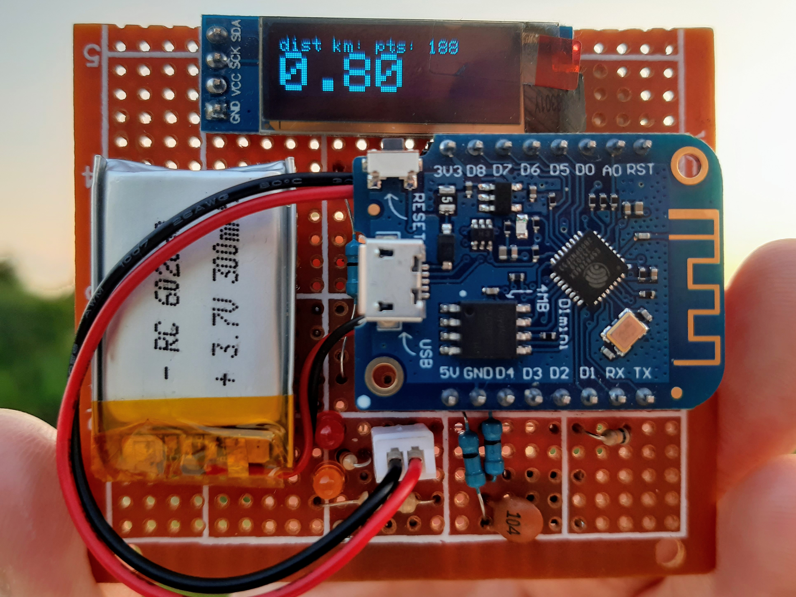

# eGPS ESP8266 Tracker

## About the project

Quectel L80 and ESP8266 based GPS tracker. Build and run. 

__Features:__

- [ YES ] Coordinates, lat,lng
- [ YES ] Tempo, min/km
- [ YES ] Speed, m/s
- [ YES ] Speed, km/h
- [ YES ] Altitude, m
- [ YES ] Satellites
- [ YES ] HDOP
- [ YES ] Distance, km
- [ YES ] Time UTC
- [ YES ] Battery charge, %
- [ YES ] Display Auto PowerOff
- [ NO  ] Sleep Mode
- [ NO  ] Web UI
- [ YES ] Saving data into a JSON file

## JSON

Output file:

~~~
{
 "device": {
  "id": "XX:XX:XX:XX:XX:XX",
  "name": "esp8266"
 },
 "file_name": "/t-300620-21:18:59.json",
 "start_date_utc": "300620",
 "start_time_utc": "21:18:59",
 "track": [
   {
    "lat" : 12.123456,
    "lng" : 21.654321
   },
   {
    "lat" : 12.123456,
    "lng" : 21.654321
   }
 ],
 "distance": 1.02
}
~~~

## Hardware

### MCU
- ESP8266EX

### Quectel L80-R
- GPS/QZSS
- 66 search channels, 22 simultaneous tracking channels
- Horizontal position accuracy: <2.5m
- Velocity Accuracy: 0.1 m/s
- Acquisition: 25 mA
- Tracking: 20 mA
- Standby Mode: 1 mA
- Chip: MT3337

### Quectel L96 
- GPS, GLONASS, Galileo (RLM supported) and BeiDou
- Horizontal position accuracy: <2.5m
- Velocity Accuracy: 0.1 m/s
- Acquisition: 22-25 mA
- Tracking: 20 mA
- Standby Mode: 1 mA
- Chip: MT3333

## ToDo
* Split up into the modules to get a better code
* Low-power mode
* Write data into the JSON files
* Create a browser file viewer
* String to char[]
* mDNS

Have Tracked!
:v:
